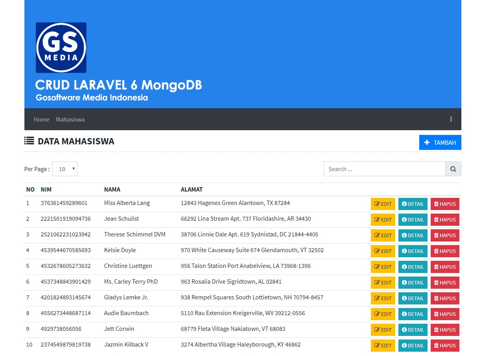

# CRUD LARAVEL 6 MongoDB
Simple Create Read Update and Delete with Laravel 6 using Database MongoDB

## First Release

## Installation
```sh
git clone https://github.com/suendri/free-crud-laravel-mongodb.git
composer install
php artisan migrate:fresh --seed
```
## Donation
Please read DONASI.txt

