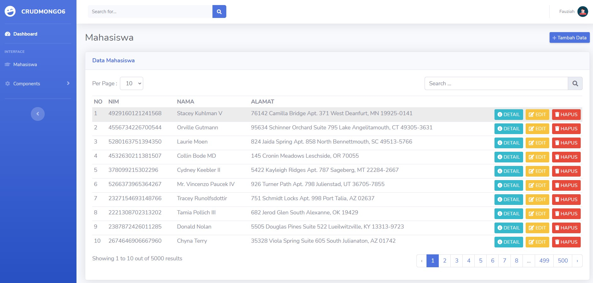

# CRUD MongoDB Laravel 6
Create Read Update and Delete with Laravel 6 using Database MongoDB

## Installation
```sh
git clone https://github.com/suendri/free-crud-mongodb-laravel6.git
composer update
php artisan migrate:fresh --seed
```

## Donation
Please read BACA-DONASI.txt dan BACA-INSTALASI.txt

